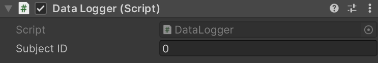

# Purrfect Pop

Purrfect Pop is a simple and motivating Virtual Reality game, originally developed in a [research context](https://www.scitepress.org/DigitalLibrary/Link.aspx?doi=10.5220/0013133600003912) aimed at investigating the use of hand tracking for accessibility and rehabilitation of individuals with cognitive disabilities.
The game is simple and intuitive, allowing interaction without penalties, making the activity engaging and not frustrating.

## The Game

At the start, the player is placed in a room that is initially empty and free of distractions.
After a quick calibration phase, a shelf with several levels appears in front of the user.
On these shelves, objects of two categories—kittens and flowers—will appear in waves, with order and quantity depending on the selected mode and parameters. These objects remain visible for a few seconds or until the player touches them with their hand.
The goal of the game is to touch as many kittens as possible that appear on the structure.

### Simple Mode

The **simple** game mode has objects appear on the shelf in waves of increasing size, starting with one object at a time and gradually increasing.
For this phase, you can adjust both the number of waves presented with the same number of objects and the time available for the player to touch all the kittens.

### Challenge Mode

The **challenge** game mode has objects appear in random order, making each trial unpredictable.
In this case, you can set the total number of waves presented, as well as a duration to subtract from each trial's available time, so the player must be increasingly faster.
Additionally, you can enable *distractor objects*, which are identical in shape to the others but marked with a red tint and should not be touched.

### Demo Mode

The **demo** mode allows the player to have a brief preview of the actual game, presenting 5 waves of objects, shown in random groups of 1 to 4 elements.

## Getting Started

This repository contains the Unity project required to play the game.
You will need the following to run it:

- An [OpenXR compatible headset](https://www.khronos.org/conformance/adopters/conformant-products/openxr) (tested with Meta Quest 2 and Meta Quest 3)
- A working installation of Unity. Development was done using [2022.3.23f1 LTS](https://unity.com/releases/editor/whats-new/2022.3.23f1).
- If using a Meta headset, a working installation of [Meta Quest Link](https://www.meta.com/help/quest/1517439565442928/) with the device properly configured. If using a different headset, follow the dedicated setup procedure suggested by the manufacturer to use it via cable in Play Mode.
- A valid license for the [FinalIK plugin](https://assetstore.unity.com/packages/tools/animation/final-ik-14290), required to animate the player's avatar.

If all the requirements above are met, you can proceed as follows:

1. Clone the repository by downloading and extracting the zip file from the GitHub page, or via command line using: `git clone https://github.com/mariannapizzo/Purrfect-Pop.git`.
2. Add the folder where the repository was cloned to the list of projects in Unity Hub and select the appropriate editor version, if not already detected automatically.
3. Start the project.
4. Install FinalIK via Unity Package Manager or by using the `.unitypackage` file, placing the `RootMotion` folder inside the `Assets/Plugins` directory. **Until this step is completed, the project cannot be run.**.
   If, after installing FinalIK, console errors persist and the game cannot be started, save your changes and restart the project.
5. Open the `MasterScene` located in the `Assets/Scenes` folder.

## Usage

The game is designed to be used by a player, assisted by a second person who manages the settings and controls the execution using a few simple keyboard commands.
The player should be prepared, standing or seated, wearing the headset and ready to receive the game execution from Unity (Quest Link mode for Meta devices).
Meanwhile, the assistant can set up the game as follows.

### Game modality and settings

The game mode and related settings can be changed by adjusting the parameters in the `Game Logic` component assigned to the `GameManager` GameObject in the scene.
The game mode is set using the *Challenge Mode* toggle at the top.
When it is off, simple mode is active; when it is on, challenge mode is active.

In the first case, the inspector will show the following:


By adjusting *Number Of Trials*, you can increase the number of waves that will be presented for each quantity of objects.
For example, choosing a value of 2 will present a single object twice, a pair twice, a triple twice, and a quadruple twice.

You can also set the time (in seconds) that the player will have to act before the presented objects disappear by changing the value of *Trial Duration*.
For example, using a value of 4 seconds, the player will have 4 seconds each time to observe the objects and touch those they choose.

When challenge mode is enabled, the inspector changes as follows:


In this case, since objects will appear in random groups, you can change the total number of presentations by adjusting *Total Number Of Trials*.
Using a value of 10 will show the player 10 different groups of objects in sequence.

In addition to specifying, as in simple mode, the time available for each group of objects presented via *Trial Duration*, you can also specify an amount of time to subtract from this for each trial, down to a minimum of 1 second, by changing the *Trial Duration Decrement* parameter.
The time available to the player will decrease as they progress through the trials.
For example, with *Total Number Of Trials* = 5, *Trial Duration* = 6, and *Trial Duration Decrement* = 1, the required trial durations will be 6, 5, 4, 3, and 2 seconds, respectively.

By enabling *Use Distractors*, you can allow distractor objects to be displayed, which the player should not touch. The probability of this happening (0-1) can be adjusted using *Distractor Spawn Chance*.
When the game generates the group of objects to show, it will take this into account and assign a red tint to objects selected as distractors, so they can be easily distinguished.
Using a *Distractor Spawn Chance* of 0.5 means there is a 50% chance that an object will be a distractor.


Also assigned to the *GameManager* GameObject is the *Data Logger* component, dedicated to saving game data.
In cases where multiple players play in sequence and you want to compare their performance afterwards, you can assign each one a numeric ID starting from 0 and specify it in the *Subject ID* field of the component.



### Game controls and flow

Once the mode and settings have been adjusted, you can start the game by pressing the Play button in Unity.
The player will be immersed in the game room, which is initially empty.
At this stage, it is necessary to first calibrate the avatar's size and then the height of the shelf where the objects will be placed.

Avatar calibration is performed by the player holding their arms extended in front of them, palms facing themselves, and touching their thumb and index finger of both hands together 2 or 3 times, or until the avatar's proportions appear appropriate.

Once avatar calibration is complete, the player should position themselves with arms extended forward, hands forward and positioned roughly at nose height.
While the player remains in this position, the assistant must press the `C` key on the keyboard.
The shelf should appear in front of the player, and they should be able to reach the top three shelves with their hands.

With the shelf positioned, the assistant can start a demo session or the actual game.
The demo is started by pressing the `D` key on the keyboard and can be repeated with the same key once finished, if the player requests additional practice.
The actual game is started by pressing the `E` key.
The session ends automatically a few seconds after the last scheduled presentation, stopping the game and saving a summary file in the `SessionData/[playerID]` folder with details of what happened during the session.

Note: For the keyboard inputs entered by the assistant to be recognized by the system, the Game View window must be in focus.
To ensure this, you can select *Play focused* from the drop-down list above it, or click inside the window with the mouse after pressing the Play button.

## Seminal Paper

Purrfect Pop is a simplified and gamified version of the software presented in the paper [Immersive versus Non-Immersive Virtual Reality Environments: Comparing Different Visualization Modalities in a Cognitive-Motor Dual-Task](https://www.scitepress.org/DigitalLibrary/Link.aspx?doi=10.5220/0013133600003912), published by Marianna Pizzo, Matteo Martini, Fabio Solari, and Manuela Chessa, members of the [Perception and Interaction Laboratory (PILab)](https://pilab.unige.it/), DIBRIS department, University of Genoa.

If you found this work interesting, you can cite it using the following Bibtex entry:

``` tex
@inproceedings{pizzoImmersiveNonImmersiveVirtual2025,
    title = {Immersive versus {{Non-Immersive Virtual Reality Environments}}: {{Comparing Different Visualization Modalities}} in a {{Cognitive-Motor Dual-Task}}},
    shorttitle = {Immersive versus {{Non-Immersive Virtual Reality Environments}}},
    booktitle = {Proceedings of the 20th {{International Joint Conference}} on {{Computer Vision}}, {{Imaging}} and {{Computer Graphics Theory}} and {{Applications}}},
    author = {Pizzo, Marianna and Martini, Matteo and Solari, Fabio and Chessa, Manuela},
    year = {2025},
    pages = {561--568},
    publisher = {{SCITEPRESS - Science and Technology Publications}},
    address = {Porto, Portugal},
    doi = {10.5220/0013133600003912},
    urldate = {2025-07-02},
    isbn = {978-989-758-728-3}
}
```
